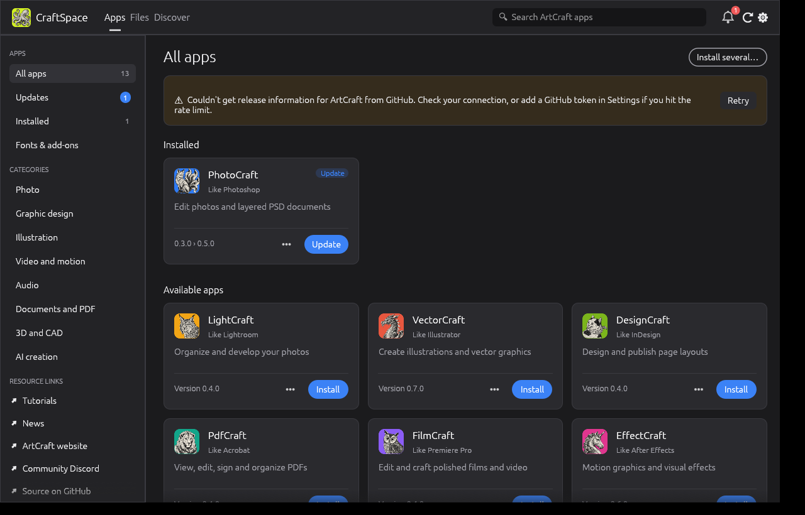
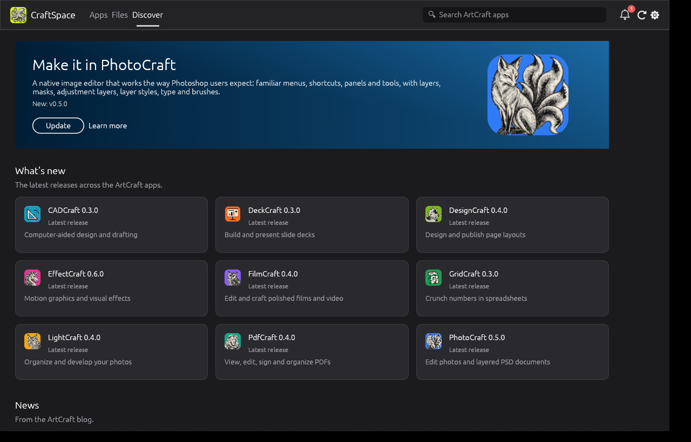
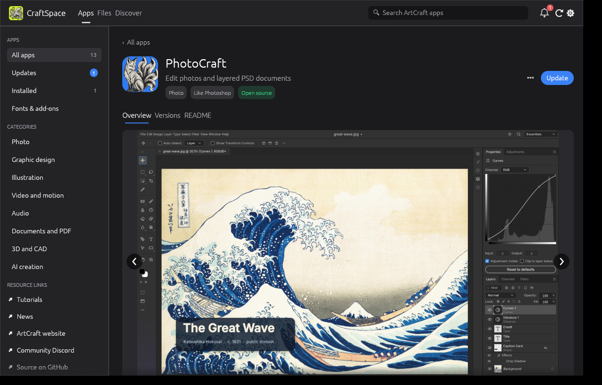
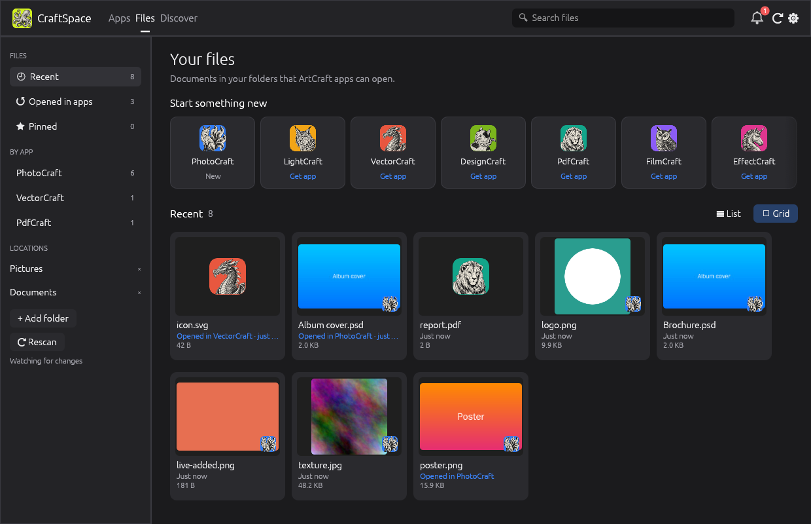
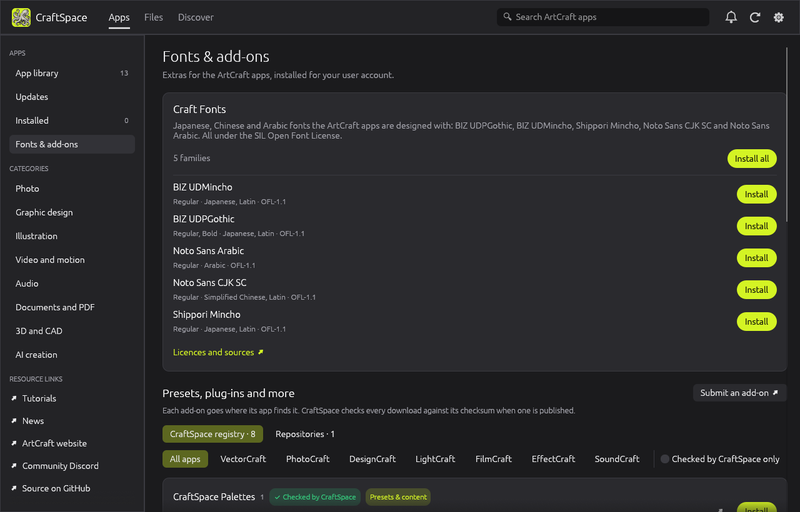

# CraftSpace

An independent installer and update manager for the open-source
[ArtCraft](https://github.com/storytold) creative apps It's written in Rust and runs on Windows, macOS and Linux.
Since they made an offical launcher, I will not maintain this project. It was a fun learning project to make a launcher and file browser! Check https://github.com/emircesur/OktoSpace for general github repo updater/installer for linux, windows and mac.



## What it does

**Apps**
- Browse every ArtCraft app (with its own icon) by category; install, open, update, roll back,
  repair or uninstall it with one click. Installs are per user and need no admin rights.
- **Install several** apps at once. Downloads queue (two at a time by default) and share one
  **Downloads** panel with combined progress. Interrupted downloads resume where they stopped,
  and you can cap the download speed.
- **App pages** open with a **screenshot tour**: the screenshots, description and feature list
  each app publishes in its AppStream metainfo file (plus the pictures in its README), in a
  carousel you can page through.
- Every app page also has an Overview, every version (install or switch to any of them), release notes
  and the app's **README**, plus **Report a problem**, which opens a GitHub issue already filled in
  with the app version, package and OS.
- **Update channels per app**: follow stable releases, include pre-releases, or stay on a version.
- **Verify and repair**: checks every installed file against what was installed and reinstalls
  if anything is missing or changed.
- **Fonts & add-ons**: installs the [craft-fonts](https://github.com/storytold/craft-fonts)
  families (Japanese, Chinese, Arabic) for your user account, checksum-verified, so every app can
  use them. Add-ons (palettes, LUT looks, LightCraft presets, PhotoCraft plug-ins, SoundCraft
  audio plug-ins) install where each app finds them, from the
  [CraftSpace add-on registry](addons/README.md) and, listed separately, add-on repositories
  such as the [ArtCraft Store](https://github.com/akkk09/artcraft-store). Add any repository by
  typing `owner/repo`; [anyone can make one](addons/README.md#craftspace-compatible-add-on-repos).
  Only CraftSpace's own packs are
  marked **checked**; everything else says **not checked for security** and asks first.
  Anyone can [submit an add-on](addons/README.md#submitting-an-add-on).
- **Appearance**: dark, light or matching the system, six accent colours, and a choice of
  placeholder icons (two-letter code, soft tile or letter), outlined or filled buttons and
  square, standard or round corners. The CraftSpace look (soft tiles, filled buttons, round
  corners) is the default; **Use the CraftSpace look** goes back to it in one click.
- **Workspace sync**: save an app's workspaces, layouts, keyboard shortcuts, preferences and
  presets to a `.craftprofile` file and bring them into the app on another computer, choosing
  which parts. Recent files, window positions, folder paths and devices stay on each computer;
  sign-ins, API keys and digital IDs are never included. The current setup is saved first, so
  an import can be undone.

**Updates**
- Checks GitHub on start and every few hours, from the tray / menu bar even when the window is
  closed, and shows a notification when updates are found. It can install them automatically.
- If an app is open, CraftSpace updates it **when it closes**, and waits for it (on Linux and
  macOS it can also update right away; the new version is used next time).
- Keeps the previous version for rollback.
- **Delta updates** for AppImages: the old AppImage plus the release's `.zsync` file rebuild the
  new one, downloading only the blocks that changed. When too little of the old file can be
  reused (a rebuilt app), it downloads the whole file instead.
- **Start at login**, quietly in the tray. If the desktop's tray (panel) starts after CraftSpace,
  the icon appears as soon as it's up; on a desktop without a tray the window is minimized
  instead, so it can always be found. Settings has a **Send a test** button for notifications.

**Files and Discover**
- **Files**: recent and pinned documents in your folders that an ArtCraft app can open, with
  **Open**, **Open with**, **Show in folder** and **Start something new** tiles. If a file needs
  an app you don't have, it offers **Get <App>**.
- **Discover**: a featured app, the latest releases across all apps, **news and tutorials** from
  getartcraft.com, apps to try, and community links.

**Safe by default**
- Every download is checked against the SHA-256 that GitHub (or the release's `SHA256SUMS.txt`)
  publishes before anything is unpacked. Packages without a checksum are refused unless you allow
  them in Settings.
- When GitHub's API is rate limited or blocked, CraftSpace finds the latest release through
  `github.com/<repo>/releases/latest/download/SHA256SUMS.txt` instead, and falls back to its cache
  when offline.

**For IT and classrooms**: a machine-wide policy file, a quiet command line, `install --all`,
app-list export/import (see [below](#managing-many-computers)).

| Discover | App details |
|---|---|
|  |  |
| **Files** | **Fonts & add-ons** |
|  |  |

## Install CraftSpace

**Windows:** with [winget](https://learn.microsoft.com/windows/package-manager/) (once the
package is accepted into winget's catalog):

```powershell
winget install emircesur.CraftSpace
winget upgrade emircesur.CraftSpace    # or `winget upgrade --all`
```

Or download `craftspace-<version>-windows-x64-setup.exe` (or `-arm64`) from
[Releases](https://github.com/emircesur/craftspace/releases) and run it: it installs for you
only, without administrator rights. For a copy that runs from any folder, take the
`-portable.zip` instead; it offers to install itself the first time. Installed either way (or
through winget), CraftSpace updates itself, and winget sees the new version too.

**macOS:** download `craftspace-<version>-macos-universal.dmg`, open it and drag CraftSpace to
Applications. Until the releases are notarized (the release workflow does it once the Apple
secrets are added), right-click it the first time and choose **Open**.

**Fedora, RHEL, openSUSE:** install `craftspace-<version>-linux-x86_64.rpm` (or `aarch64`):

```sh
sudo dnf install ./craftspace-0.1.0-linux-x86_64.rpm
```

Once the [Copr repository](#fedora-copr) is set up, `dnf` keeps CraftSpace up to date instead:

```sh
sudo dnf copr enable emircesur/craftspace
sudo dnf install craftspace
```

**Debian, Ubuntu:** `sudo apt install ./craftspace-<version>-linux-x86_64.deb`.

**Any Linux (AppImage):** download `craftspace-<version>-linux-x86_64.AppImage` (or `aarch64`),
make it executable and run it:

```sh
chmod +x craftspace-*-linux-x86_64.AppImage && ./craftspace-*-linux-x86_64.AppImage
./craftspace-*-linux-x86_64.AppImage --cli list      # the command line, from the same file
```

It offers to add itself to your app menu (keeping a copy in CraftSpace's folder) and updates
that copy itself. The AppImage also carries update information for AppImageUpdate.

**Any Linux (script):**

```sh
curl -fsSL https://raw.githubusercontent.com/emircesur/craftspace/HEAD/install.sh | sh
```

This downloads the latest tarball, checks its checksum, and runs `craftspace-cli self-install`,
which adds CraftSpace to your app menu and links `craftspace` and `craftspace-cli` into
`~/.local/bin`.

Installed from an `.rpm` or `.deb`, CraftSpace leaves its own updates to the package manager.

## How apps are installed

ArtCraft releases follow one naming scheme, `<app>-<version>-<platform>[-portable].<ext>`, with a
`SHA256SUMS.txt` next to them. CraftSpace picks the right file for your machine:

| | Preferred | Also understood |
|---|---|---|
| Windows x64 / ARM64 / x86 | `…-windows-x64-portable.zip` | `.msi`, setup `.exe` (ArtCraft's NSIS installer) |
| macOS (Intel and Apple silicon) | `…-macos-universal.dmg` | |
| Linux x86_64 / aarch64 | `…-linux-x86_64.tar.gz` | `.AppImage` (with delta updates), `.rpm`, `.deb` |

Portable zips, tarballs, AppImages and disk images go into one folder per app that stays the
same for every version (`…\Apps\PdfCraft\pdfcraft.exe`, or `<your folder>\PdfCraft\pdfcraft.exe`
when you pick where to install), so default apps and "Open with" choices keep working after
updates. A new version is unpacked next to it first and then swapped in, so an update never
leaves a half-written app behind; the previous version moves to a hidden `.versions` folder
beside it, kept for rollback:

| | Windows | macOS | Linux |
|---|---|---|---|
| Apps | `%LOCALAPPDATA%\CraftSpace\Apps\<App>` | current version in `~/Applications`, older ones in `~/Library/Application Support/CraftSpace` | `~/.local/share/craftspace/apps/<App>` |
| Menu entry | Start menu › ArtCraft › *App* | Launchpad / Spotlight | `.desktop` file with the app's icons and MIME types |
| Command line | | | `~/.local/bin/<app>` and `<app>-cli` |
| Uninstall entry | Settings › Apps | | |
| "Open with" | registered per user for the app's file types | from the app | from the app's MIME types |

On Fedora and Debian-based systems, Settings › **Install apps as system packages** installs each
app's `.rpm` through dnf (or zypper) or its `.deb` through apt instead, asking for your password
through the desktop's prompt (pkexec). The package manager then owns the files, and CraftSpace
still finds updates and installs the new package; verify uses `rpm -V` / `dpkg --verify`.

Setup programs and MSIs (ArtCraft ships one) run silently; CraftSpace then finds the program and
its uninstaller through the Settings › Apps entry the installer created. On Windows the
`portable.txt` marker is removed so app preferences live in `%APPDATA%` and survive updates.

## Command line

```text
craftspace-cli list                       # every app, installed version, latest version
craftspace-cli install photocraft gridcraft
craftspace-cli install photocraft --version 0.3.0
craftspace-cli install --all
craftspace-cli update                     # update everything (or name apps)
craftspace-cli check                      # exit code 10 when updates are available
craftspace-cli rollback photocraft
craftspace-cli verify photocraft          # exit code 11 when files are damaged
craftspace-cli repair photocraft
craftspace-cli channel photocraft pin     # stay on the installed version (or stable / prerelease / default)
craftspace-cli launch photocraft ~/Pictures/poster.psd
craftspace-cli uninstall photocraft
craftspace-cli fonts list | install [family] | uninstall [family]
craftspace-cli export apps.json && craftspace-cli import apps.json [--exact]
craftspace-cli news                       # news and tutorials from getartcraft.com
craftspace-cli report-bug photocraft
craftspace-cli autostart on|off
craftspace-cli config [key] [value]       # e.g. config download_limit_kbps 2048
craftspace-cli self-update | self-install | paths | cleanup
craftspace-cli detect                     # find apps installed without CraftSpace and adopt them
craftspace-cli open-file poster.psd       # open a file in the app that handles it
craftspace-cli file-types list | on [ext…] | off [ext…]
craftspace-cli source list | enable | disable | check owner/repo | add owner/repo [--binary name]
craftspace-cli source set photocraft someone/photocraft-fork   # or `official` to go back
craftspace-cli addons list [--app photocraft] [--checked] | info ID | install ID [--yes] | remove ID
craftspace-cli addons repos [add owner/repo | remove ID | enable ID | disable ID] | check FILE
craftspace-cli profile export photocraft [--parts layouts,shortcuts] [--out FILE]
craftspace-cli profile import FILE [--parts …] | show FILE | parts APP | backups APP
```

For IT and classrooms:

```text
craftspace-cli apply-policy               # install required apps, move apps to pinned versions
craftspace-cli policy show [--json] | check policy.json | refresh
craftspace-cli update --scheduled         # for a scheduled task: only inside the update window
craftspace-cli report [--json] [--out FILE] [--to-share]
craftspace-cli cache fill [apps…] [--dir DIR] [--all-platforms] | status
craftspace-cli reset photocraft | --all [--yes]   # fresh app settings between classes (kept as a backup)
```

`--quiet` prints nothing but errors and runs installers without any windows. `--refresh` skips
the 10-minute release cache. `-v` shows what is happening. Set `GITHUB_TOKEN` (or add a token in
Settings) to raise GitHub's rate limit. `CRAFTSPACE_HOME` puts all of CraftSpace's state under
one folder.

## Managing many computers

Deploy a `policy.json` to `%ProgramData%\CraftSpace\` (Windows),
`/Library/Application Support/CraftSpace/` (macOS) or `/etc/craftspace/` (Linux):

```json
{
  "organization": "Riverside School Art Lab",
  "support": "https://help.example.edu/art-lab",
  "settings": { "auto_install_updates": true, "include_prereleases": false },
  "lock_settings": false,
  "required_apps": ["photocraft", "pdfcraft"],
  "allowed_apps": ["photocraft", "pdfcraft", "gridcraft"],
  "blocked_apps": [],
  "pinned_versions": { "photocraft": "0.3.0" },
  "update_window": { "days": ["mon", "tue", "wed", "thu", "fri"], "from": "17:00", "to": "07:00" },
  "prevent_uninstall": true,
  "report_dir": "\\\\server\\craftspace\\reports",
  "policy_url": "https://example.edu/craftspace/policy.json",
  "disable_self_update": false,
  "quiet": true
}
```

- `settings` values are forced and shown as locked in the app; `lock_settings` locks all of them.
- `required_apps` are installed on start (or with `craftspace-cli apply-policy` from a login
  script); `allowed_apps` hides everything else and `blocked_apps` hides single apps.
- `pinned_versions` keeps every computer on the same version (older or newer ones are replaced).
- `update_window` limits automatic updates to those hours (past midnight works); manual updates
  are always allowed, and `craftspace-cli update --scheduled` does nothing outside it.
- `prevent_uninstall` hides Uninstall, Rollback and channel choices; only an administrator can
  uninstall from the command line.
- `report_dir` gets a `<computer name>.json` after each check: computer, OS, CraftSpace and every
  app's version and update state. `craftspace-cli report` prints the same.
- `policy_url` is fetched on each check and its values replace this file's (from the next start,
  or right away with `apply-policy`), so a whole room changes from one place.
- `organization` and `support` show as a "Managed by" badge in the app's top bar.
- `profiles` hands every computer a workspace profile (the teacher's layouts, shortcuts and
  presets, saved with `craftspace-cli profile export`): `"apply": "once"` when it's new or
  changed, or `"every-start"` so each class starts the same.
- `block_unchecked_addons` allows only add-ons checked by CraftSpace.

Classrooms can share a **package cache**: set a folder (Settings › IT & Classroom, or
`craftspace-cli config package_cache '\\server\craftspace\packages'`), fill it once with
`craftspace-cli cache fill`, and every computer installs from it after checking the published
checksum. `package_cache_write` lets computers add what they download. An exported app list
(`craftspace-cli export`) sets up a lab the same way: `craftspace-cli --quiet import apps.json --exact`.

## Building

```sh
cargo run -p craftspace          # the app
cargo run -p craftspace-cli -- list
cargo test --workspace
```

The workspace has three crates:

- `crates/craftspace-core`: catalog, GitHub release discovery, downloads (resume, speed limit,
  zsync deltas), unpacking, desktop integration, fonts, policy and update logic. No UI.
- `crates/craftspace`: the desktop app ([egui](https://github.com/emilk/egui), the same UI
  toolkit the ArtCraft apps use).
- `crates/craftspace-cli`: the command line.

CI (`.github/workflows/ci.yml`, scripts in `ci/`) runs:

- the tests and clippy on Windows, macOS and Linux;
- end-to-end installs of real ArtCraft releases on each: install, update, rollback, repair,
  uninstall, policy, export/import, fonts, delta updates;
- a GUI smoke test on each desktop: the window opens, the tray icon registers (on Linux with a
  real panel that starts after CraftSpace), a test notification is accepted, and closing the
  window keeps CraftSpace in the tray. Screenshots are uploaded with the run;
- a Fedora container that builds the RPM the way Copr does, installs it with dnf, and installs
  ArtCraft apps as RPMs with it.

Pushing a `v*` tag builds Windows (x64, ARM64), macOS (universal `.dmg`) and Linux (x86_64,
aarch64: `.tar.gz`, `.deb`, `.rpm`) packages and publishes them with a `SHA256SUMS.txt`
(`.github/workflows/release.yml`). They use the ArtCraft naming scheme, which is how CraftSpace
finds its own updates.

### Fedora Copr

[Copr](https://copr.fedorainfracloud.org) builds CraftSpace for every Fedora release and serves it
as a dnf repository, so Fedora users get updates with the rest of their system. Setup, once:

1. Sign in to Copr with a Fedora account and create a project named `craftspace` with the
   Fedora releases (and architectures) to build for.
2. From <https://copr.fedorainfracloud.org/api/>, add the repository secrets `COPR_LOGIN`,
   `COPR_USERNAME` and `COPR_TOKEN`.

From then on, publishing a release submits a Copr build (`.github/workflows/copr.yml`). Copr
runs `make -f .copr/Makefile srpm`, which vendors the crates, and builds
`packaging/fedora/craftspace.spec` offline. The same build runs in CI, so it's tested on every
push.

Getting into Fedora's own repositories goes through Fedora's package review: a packager
account and sponsor, and following the Rust packaging guidelines (each crate dependency packaged
as `rust-*`, no vendoring). The spec is a starting point for that.

### winget

After a release, run [`winget.yml`](.github/workflows/winget.yml) by hand (Actions › winget › Run workflow, with the release's tag): it writes the manifests
(`packaging/winget/manifests.py`), checks them against winget's schemas, installs, finds and
uninstalls CraftSpace with winget on Windows, and opens the pull request on
[microsoft/winget-pkgs](https://github.com/microsoft/winget-pkgs). Opening the pull request
needs a `WINGET_TOKEN` repository secret: a classic token with the `public_repo` scope. Without
it, the manifests are only built, tested and kept as the run's `winget-manifests` artifact.

The ArtCraft apps themselves aren't in winget; CraftSpace updates them (`craftspace-cli update`).

### Adding an app

Add an entry to `catalog.json` with the GitHub repository, an icon URL, a two-letter fallback
badge, colors and the file extensions it opens, and bump `revision`. As long as the app's
releases follow the naming scheme above, nothing else is needed.

## License

MIT or Apache-2.0, at your option. CraftSpace is a community project. Done for Education purposes only. It isn't affiliated with
the ArtCraft developers, Adobe or Microsoft. App names and icons belong to their owners;
CraftSpace downloads the icons from the apps' own repositories instead of bundling them.
